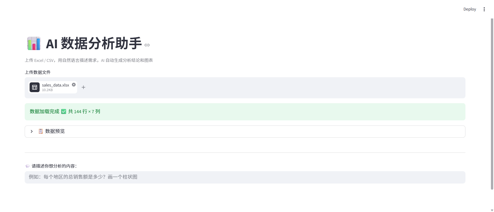
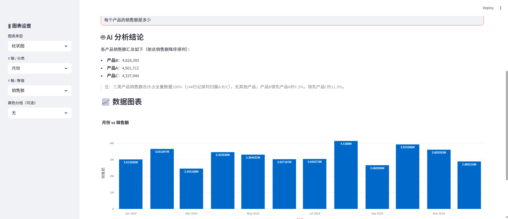
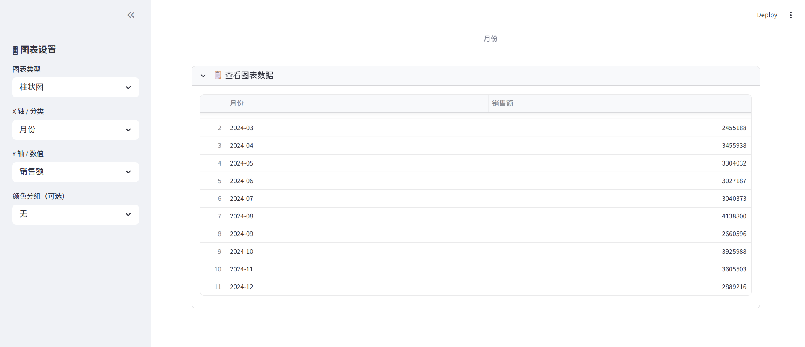

# 📊 AI 数据分析助手

基于大语言模型开发的智能数据分析工具，支持上传 Excel / CSV 文件，用自然语言描述分析需求，AI 自动生成分析结论并渲染交互式图表。

## ✨ 功能特点

- 支持 Excel / CSV 文件上传与解析
- 自然语言提问，AI 生成专业分析结论
- 自动渲染柱状图、折线图、饼图、散点图
- 支持按地区、产品等维度灵活分组
- 侧边栏自定义图表类型与字段
- 简洁易用的 Web 界面（Streamlit）

## 🛠 技术栈

| 模块 | 技术 |
|------|------|
| 数据处理 | pandas |
| 数据可视化 | Plotly Express |
| 大语言模型 | 通义千问 qwen-turbo |
| 链路编排 | LangChain LCEL |
| 前端界面 | Streamlit |

## 🚀 本地运行

**1. 克隆项目**
```bash
git clone https://github.com/pingguoli182-sys/Data-Analyst.git
cd Data-Analyst
```

**2. 安装依赖**
```bash
pip install langchain langchain-community openai streamlit pandas plotly openpyxl python-dotenv dashscope
```

**3. 配置 API Key**

在项目根目录新建 `.env` 文件：

**4. 启动应用**
```bash
python -m streamlit run app.py
```

打开浏览器访问 `http://localhost:8501`

## 📸 使用方式

1. 上传 Excel 或 CSV 文件
2. 在输入框描述分析需求（例如：每个地区的总销售额是多少？）
3. 查看 AI 生成的分析结论
4. 在左侧边栏调整图表类型和字段
5. 查看交互式图表和聚合数据

## 📸 项目截图






## 👩‍💻 作者

李佳 · [github.com/pingguoli182-sys](https://github.com/pingguoli182-sys)